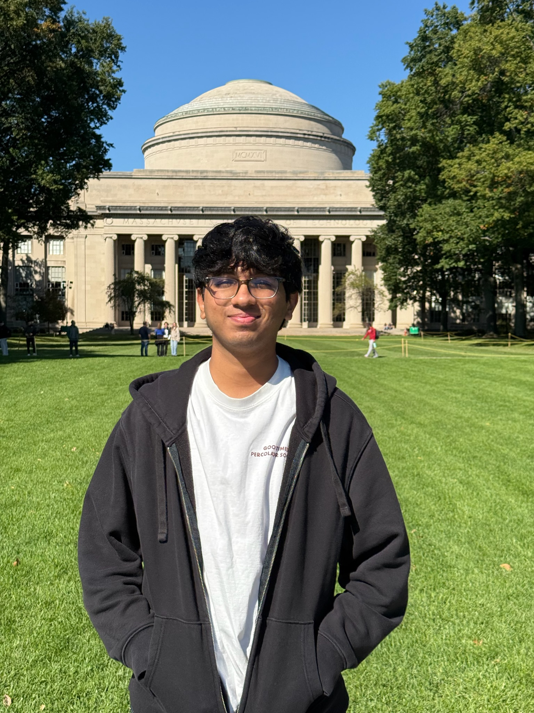

    
    

        <h1 style="margin-top: 0;">Shreyas Bachiraju</h1>
        

            Informatics undergraduate at Arizona State University. Researcher in sustainable urban computing and efficient AI for autonomous systems.
        

    

## About Me

I am an undergraduate researcher at Arizona State University studying machine learning, model compression, and sustainable urban computing. My recent projects involve generative AI for transportation planning, reinforcement learning dataset distillation, and energy-efficient inference for large models. I am broadly interested in developing efficient, reliable machine learning systems for real-world smart city applications.

    
    
<em>Semantic segmentation for urban density understanding (U-Plan)</em>

My research explores practical challenges in deploying AI at scale. This includes compressing reinforcement learning training runs into compact synthetic datasets, profiling energy bottlenecks in Mixture-of-Experts models, and optimizing neural networks for edge devices. Through the Fulton Undergraduate Research Initiative and my work at the Data Mining and Reinforcement Learning Lab, I investigate how to bridge the gap between state-of-the-art models and resource-constrained deployment environments.

Beyond research, I co-founded CS+Social Good at ASU to build a community to build tech projects that empower NGOs in need of technical tools. Outside of academia, I'm an avid football (soccer :P) fan and music producer! I believe technical excellence and thoughtful consideration of AI's societal impact should go hand in hand.

## Recent Highlights

**🏆 HackHarvard 2024 Winner** — 1st Place in Sustainability Track for U-Plan, an AI-powered urban heat island mitigation platform

**📝 Research Publications** — Co-author on paper at Reinforcement Learning Conference 2025 and survey paper under journal revision on generative AI in transportation planning

**🎓 CRA Outstanding Undergraduate Researcher Honorable Mention** — Recognized nationally by the Computing Research Association for exceptional research achievement (2025-26)

**🔬 Fulton Forge Research Expo** — Presented poster on neural network compression for edge devices, achieving 99% accuracy retention with 42% model size reduction

**👥 Leadership & Teaching** — Founding Co-President of CS + Social Good at ASU, Undergraduate TA for Advanced Object-Oriented Programming

Explore my [publications](/publications), [research](/research), [experience](/experience), [projects](/projects), and [awards](/awards).

