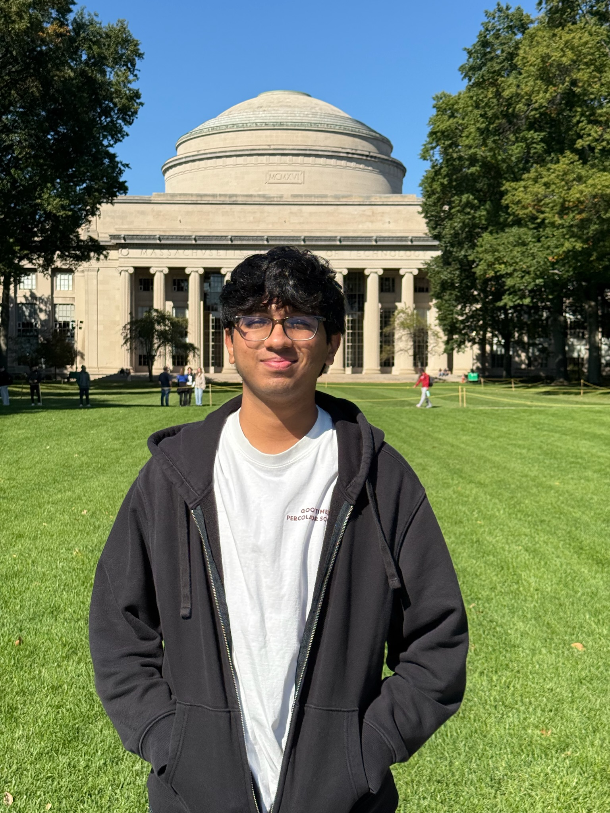

    
    

        Machine Learning Researcher
        <h1 style="margin-top: 0;">Shreyas Bachiraju</h1>
        

            Master's student in Machine Learning at <strong>Carnegie Mellon University</strong>. I build efficient, reliable ML systems — spanning model compression, sustainable AI, and machine learning for smart cities.
        

        

            <a href="https://github.com/shreyasbachi" target="_blank">GitHub</a>
            <a href="https://linkedin.com/in/shreyasbachiraju" target="_blank">LinkedIn</a>
            <a href="https://scholar.google.com/citations?user=HBA8ZHwAAAAJ&hl=en" target="_blank">Google Scholar</a>
            <a href="mailto:shreyasbachiraju@gmail.com">Email</a>
            <a href="/files/BachirajuShreyas_Resume_Grad.pdf" target="_blank">Resume</a>
        

    

    
2Published papers

    
100×Faster RL training

    
1stHackHarvard 2024

    
3.95Undergrad GPA

## About Me

I'm a Master's student in Machine Learning at **Carnegie Mellon University**, where I focus on efficient and reliable machine learning systems. I completed my B.S. in Informatics at Arizona State University (GPA 3.95), where I spent two years as an undergraduate researcher across reinforcement learning, model compression, and sustainable urban computing.

My work sits at the intersection of state-of-the-art models and real-world deployment constraints. Recent projects include compressing 100K-step reinforcement learning runs into tiny synthetic datasets, profiling energy bottlenecks in Mixture-of-Experts language models, generative AI for transportation planning, and optimizing neural networks for edge devices like the Jetson Nano.

    
    
Semantic segmentation for urban density understanding (U-Plan)

Beyond research, I co-founded **CS + Social Good at ASU** to build a community shipping technical tools for NGOs. Outside of academia, I'm an avid football (soccer :P) fan and a music producer. I believe technical excellence and thoughtful consideration of AI's societal impact should go hand in hand.

## Education

    <h3>Carnegie Mellon University</h3>
    M.S. in Machine Learning · 2026 – Present
    
Graduate study in the theory and systems of machine learning at the School of Computer Science.

    Machine Learning
    Efficient AI
    Systems

    <h3>Arizona State University</h3>
    B.S. in Informatics · GPA 3.95 · 2022 – 2026
    
New American University Scholar · Dean's List (all semesters) · Founding Co-President, CS + Social Good · Undergraduate TA for Advanced Object-Oriented Programming in Java.

    Informatics
    Research
    Leadership

## Recent Highlights

**🎓 CMU Machine Learning** — Started my Master's in Machine Learning at Carnegie Mellon University

**🏆 HackHarvard 2024 Winner** — 1st Place in the Sustainability Track for U-Plan, an AI-powered urban heat island mitigation platform

**📝 Research Publications** — Co-author on a paper at the Reinforcement Learning Conference 2025 and a survey on generative AI in transportation planning (under journal revision)

**🎯 CRA Outstanding Undergraduate Researcher (Honorable Mention)** — Recognized nationally by the Computing Research Association for exceptional research achievement (2025–26)

**🔬 Fulton Forge Research Expo** — Presented a poster on neural network compression for edge devices, retaining 99% accuracy with a 42% reduction in model size

Explore my [publications](/publications), [research](/research), [experience](/experience), [projects](/projects), and [awards](/awards).
